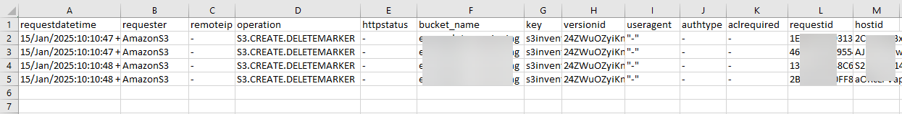
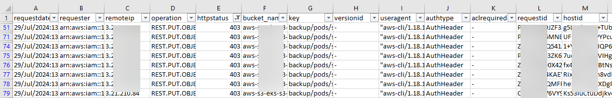
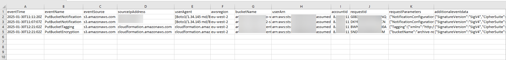
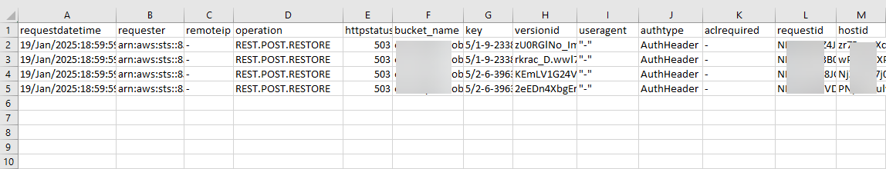
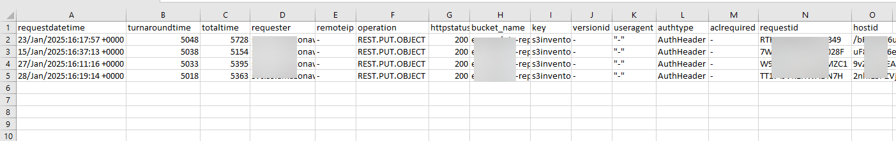
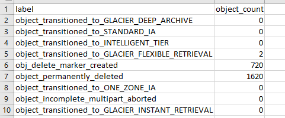
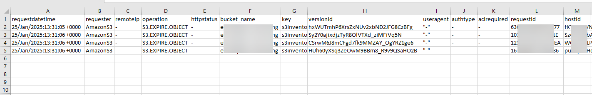
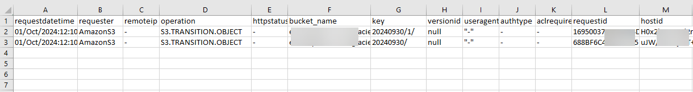

# Guidance for Automated Querying of Amazon S3 Logs with Amazon Athena

## Table of Contents

1. [Overview](#1-overview)
2. [Key Features](#2-key-features)
3. [Cost](#3-cost)
4. [Prerequisites](#4-prerequisites)
5. [Deployment Steps](#5-deployment-steps)
6. [Deployment Validation](#6-deployment-validation)
7. [Accessing the Query Results](#7-accessing-the-query-results)
8. [Cleanup](#8-cleanup)
9. [Troubleshooting, Guidance, Limitations and Additional Resources](#9-troubleshooting-guidance-limitations-and-additional-resources)
10. [Feedback](#10-feedback)
11. [License](#11-license)
12. [Notices](#12-notices)

## 1. Overview

The S3 Log Query guidance provides an automated workflow to query [Amazon S3](https://aws.amazon.com/s3/) server access logs and [CloudTrail](https://aws.amazon.com/cloudtrail/) logs. This solution helps customers query and audit API requests made to their S3 buckets and objects, providing valuable insights for troubleshooting, security analysis, and support case deflection.

#### High Level workflow

#### Architecture

## 2. Key Features

The solution includes the following predefined queries:

* ****Auditing Object Access****:

This guidance includes a predefined athena query to discover who accesses (GetObject) an object, and the associated details (timestamp, IP address, IAM role). This allows you to track applications or principals attempting to access data stored in your Amazon S3 bucket.

* ****Auditing Accidental Deletions****:

Runs a query to discover who deleted an object, when, and the associated details (timestamp, IP address, IAM role). This helps to identifies whether the objects were deleted by a DELETE API request or a Lifecycle expiration rule

* ****API Request Details (403 Access Denied)****:

Queries server access log events based on operation, time period, requestor, response, and other fields.
Provides detailed information about API requests that resulted in 403 Access Denied errors.

* ****Bucket-level Configuration Auditing****:

Includes queries for bucket level configuration changes, including when bucket versioning was suspended, bucket policy updates, Lifecycle rule changes, Replication configuration updates, Block Public Access settings changes, and encryption setting updates.

* ****Bucket Performance (5xx Errors)****:

Checks the number of 5xx errors returned by Amazon S3 within a given time frame, and includes details such as requester, operation and other important details.

* ****Networking****:

Identifies Client latency to Amazon S3, sorts by the highest turnaround time for a specific time period, requestor, or operation.

* **Lifecycle Action Statistics**:

Provides statistics of Amazon S3 lifecycle actions such as count of object transitions and expiration. 

* **Lifecycle Actions**:

Provides details of Amazon S3 lifecycle actions such as object transitions and expiration per object. 

* Expiration:

* Transition:

* **Top troubleshooting queries**:

This query combines the results from:

* Client errors (4xx)
* Service errors (5xx)
* Object deletions
* Lifecycle expiration
* Lifecycle transition

**Feature matrix**

The guidance provides two separate cloudformation templates for querying Amazon S3 access log and Cloudtrail events. See below the queries available in each template

| Feature       | Server Access Log template | Cloudtrail log template |
|:--------- |:------------ |:------------ |
| Object Access	| Y | Y |
| Client errors, including AccessDenied	| Y | Y |
|Object deletions via S3 API	| Y	| Y |
|Object expiration and transition and lifecycle statistics via S3 Lifecycle rules	| Y	| N |
|Networking/Latency	| Y	| N |
|Bucket Performance (5xx Errors)	| Y	| N |
|Bucket-level Configuration Auditing	| N	| Y |
|Top troubleshooting queries	| Y	| N |

## 3. Cost

There are costs associated with using this solution. The solution uses several AWS services, including:

* [Amazon S3](https://aws.amazon.com/s3/)
* [AWS Lambda](https://aws.amazon.com/lambda/)
* [Amazon Athena](https://aws.amazon.com/athena/)
* [AWS Glue](https://aws.amazon.com/glue/)
* [Amazon Simple Notification Service (SNS)](https://aws.amazon.com/sns/)
* [AWS CloudFormation](https://aws.amazon.com/cloudformation/)
* [AWS Identity and Access Management (IAM)](https://aws.amazon.com/iam/)

Please refer to the pricing pages of these services for detailed cost information. The actual cost will depend on the volume of logs processed and the frequency of analysis.

***Sample Cost:***

Cost for running 3 different queries, over different time ranges and prefix. This shows the cost for Amazon Athena queries, Amazon SNS notifications, Batch Operations jobs (3 jobs), Lambda invocation and Amazon S3 API and storage cost for the solution bucket

|Service	|Athena($)	|S3($)	|Lambda($)	|SNS($)	|Total costs($)	|
|---	|---	|---	|---	|---	|---	|
|Service total	|0.03909	|0.77978	|0	|0	|0.05686	|
|4/1/2025	|0.01305	|0.51429	|0	|0	|0.52734	|
|4/2/2025	|0.02604	|0.26355	|0	|0	|0.28959	|
|4/3/2025	|	|0.00194	|	|	|0.00194	|

## 4. Prerequisites

To use this solution, you need:

* An AWS Account and an IAM role or user with appropriate permissions
* S3 server access logs or CloudTrail logs configured for your S3 buckets
* Basic knowledge of AWS CloudFormation

## 5. Deployment Steps

1. Download the CloudFormation template, for [server access log](deployment/support-tool-server-access-logs-latest.yaml) or for [Cloudtrail events](deployment/support-tool-cloudtrail-logs-latest.yaml), depending on your log type
2. Log in to the AWS Management Console and navigate to the CloudFormation service.
3. Choose "Create stack" and upload the template file.
4. Fill in the stack parameters:

| Name       | Description |
|:--------- |:------------ |
|Stack name	| Any valid alphanumeric characters and hyphen |
|YourS3LogBucket	| The bucket where your logs are stored	|
|YourS3LogBucketPrefix	| Specify the prefix to limit the amount of data copied and reduce cost	|
|YourProductionS3Bucket	| The name of the S3 bucket you want to analyze	|
|YourS3LogType	| Choose between S3AccessLogs or CloudTrail	|
|Include logs created AFTER this date	| Specifies the Start date range of logs to include	|
|Include logs created BEFORE this date	| Specifies the End date range of logs to include	|
|AnalysisType	| Choose the type of analysis to to perform (e.g., AnonymousAccess, CreateBucket, DeleteBucket, PutBucket, DeleteObject, AccessDenied, ServiceError-5xx, etc.)	|
|ContactEmail	|Email address for notifications	|

**_Note:_** : the "Include logs created AFTER" date cannot be the same date as "Include logs created BEFORE" date, it has to be earlier!

* Review and create the stack.

Sample stack deployment for querying CloudTrails logs:

 

## 6. Deployment Validation

* Wait for the CloudFormation stack to reach the CREATE_COMPLETE status:

* Check your email and confirm the subscription to the SNS topic.

* An Amazon S3 Batch Operations copy Job is initiated by the solution to automatically start copying logs matching the selected date range to the solution Amazon S3 bucket 

  

* The stack creates multiple resources including an Amazon S3 bucket, logs from the customer provided logs bucket will be copied to the S3 bucket within the “support” prefix

* The diagram below shows the newly copied logs from the source bucket.

* The solution will start analyzing logs and send a notification to the specified email address when the query starts and also when the results are ready.
* You can also monitor the progress of the analysis by checking the CloudWatch Logs for the Lambda functions deployed by the solution.
* You can monitor the progress of the Athena query from the Athena Management Console. Select “Query Editor”,  at the “Workgroup” drop-down, select the Workgroup created by the solution and then select the “Recent Queries” tab. A query in progress shows "Running" status.

* You can also run your own custom queries by modifying the queries displayed above in the query editor, by directly using the Athena query editor

## 7. Accessing the Query Results

You will get an email notification once the query results are ready, this will include the Amazon S3 path to the results location. To access the query results, please use either the Amazon S3 Management Console or using the AWS-CLI. An email notification is sent when the query completes with the full S3 path of the CSV result file, see below screenshot:

The results are in CSV format, so you can choose to download and review them manually on your desktop, share with [AWS Support team](https://docs.aws.amazon.com/awssupport/latest/user/getting-started.html) via a [Support Case](https://docs.aws.amazon.com/awssupport/latest/user/case-management.html) or analyze the results with your desired analysis tool. 

For example to download the result data using AWS-CLI, you can use below command:

>$ aws s3 cp s3://s3-tool-1234567890-eu-west-2-sal-query-final-1/support/s3/processed/csv/5d62d987-b272-4564-aa2c-9cb3dc7302fe.csv .

You can also access the query result via the Amazon S3 Management Console, see full path below:

## 8. Cleanup

To avoid ongoing costs, delete the CloudFormation stack when you're done:

1. Go to the CloudFormation console.
2. Select the stack you created.
3. Choose "Delete" and confirm.

This will remove all resources created by the solution, except the Amazon S3 bucket containing the query results. 

A lifecycle expiration rule is automatically applied to the guidance S3 bucket to expire the raw logs copied to it by Amazon S3 Batch operations after 1 day, however, the query results are retained for audit purposes.

## 9. Troubleshooting, Guidance, Limitations and Additional Resources

### Troubleshooting

* If you don't receive email notifications, check your email spam folder and ensure you've confirmed the SNS subscription.
* Check CloudWatch Logs for Lambda function logs if you encounter issues.
* Ensure the S3 bucket where your logs are stored is accessible to the S3BatchOperations IAM roles created by the solution. If your objects are encrypted with Customer Managed KMS keys, please ensure you grant the solution IAM role the required permissions You can grant these required permissions before Batch Operations job status changes to active to avoid task failures. To see the ARN of the IAM role created by the solution, please goto the solution Stack, and select the “Outputs” tab. 

### Guidance

* If there are a lot of logs, it is possible that the Athena query can run longer than the [default DML query timeout](https://docs.aws.amazon.com/athena/latest/ug/service-limits.html) of 30 mins, please consider reducing the number of days analyzed or request for DML query timeout [limit increase](https://console.aws.amazon.com/servicequotas/home?region=us-east-1#!/services/athena/quotas)
* Consider running the analysis on a periodic schedule (e.g., weekly or monthly) to stay on top of your S3 activity.
* Review the Athena queries in the solution to understand the analysis being performed and customize them as needed.

### Limitations

* The solution is designed to work with S3 server access logs or CloudTrail logs. Other log formats are not supported.
* There may be a delay between log generation and availability for analysis.
* The solution does not provide real-time monitoring or alerting. It's designed for historical analysis and reporting.

### Additional Resources

* [Amazon S3 Server Access Logging](https://docs.aws.amazon.com/AmazonS3/latest/dev/ServerLogs.html)
* [AWS CloudTrail](https://aws.amazon.com/cloudtrail/)
* [Amazon Athena User Guide](https://docs.aws.amazon.com/athena/latest/ug/what-is.html)
* [AWS Glue Developer Guide](https://docs.aws.amazon.com/glue/latest/dg/what-is-glue.html)
* [AWS Lambda Developer Guide](https://docs.aws.amazon.com/lambda/latest/dg/welcome.html)
* [Amazon Simple Notification Service (SNS) Developer Guide](https://docs.aws.amazon.com/sns/latest/dg/welcome.html)
* [Amazon S3 Batch Operations](https://docs.aws.amazon.com/AmazonS3/latest/userguide/batch-ops.html)
* [Amazon S3 User Guide](https://docs.aws.amazon.com/AmazonS3/latest/userguide/Welcome.html)
* [AWS Identity and Access Management (IAM) User Guide](https://docs.aws.amazon.com/IAM/latest/UserGuide/introduction.html)

## 10. Feedback

To submit feature ideas and report bugs, use the [Issues section of the GitHub repository](https://github.com/aws-solutions-library-samples/guidance-for-automated-querying-of-amazon-s3-logs-with-amazon-athena/issues) for this guidance

## 11. License

This solution is licensed under the MIT-0 License. See the [LICENSE](LICENSE) file.

## 12. Notices

See [CONTRIBUTING](CONTRIBUTING.md#security-issue-notifications) for more information.

This document is provided for informational purposes only. It represents current AWS product offerings and practices as of the date of issue of this document, which are subject to change without notice. Customers are responsible for making their own independent assessment of the information in this document and any use of AWS products or services, each of which is provided "as is" without warranty of any kind, whether expressed or implied. This document does not create any warranties, representations, contractual commitments, conditions, or assurances from AWS, its affiliates, suppliers, or licensors. The responsibilities and liabilities of AWS to its customers are controlled by AWS agreements, and this document is not part of, nor does it modify, any agreement between AWS and its customers.

